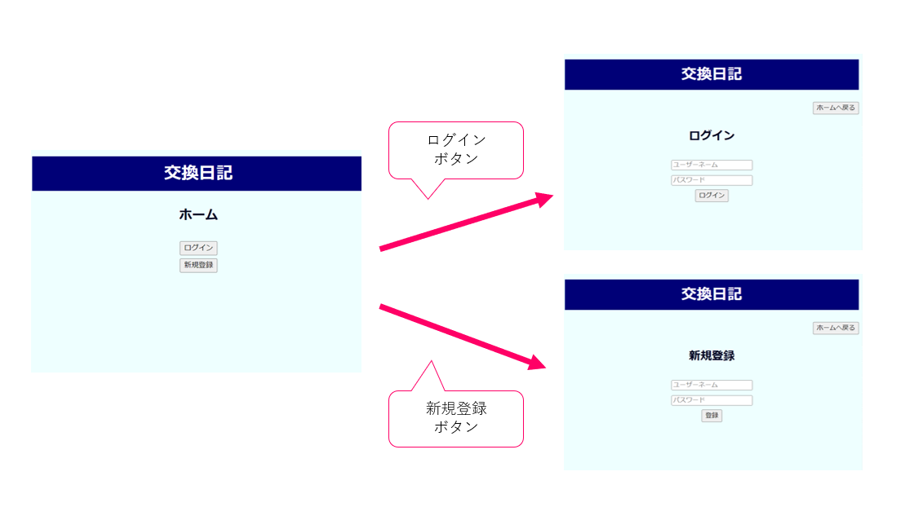
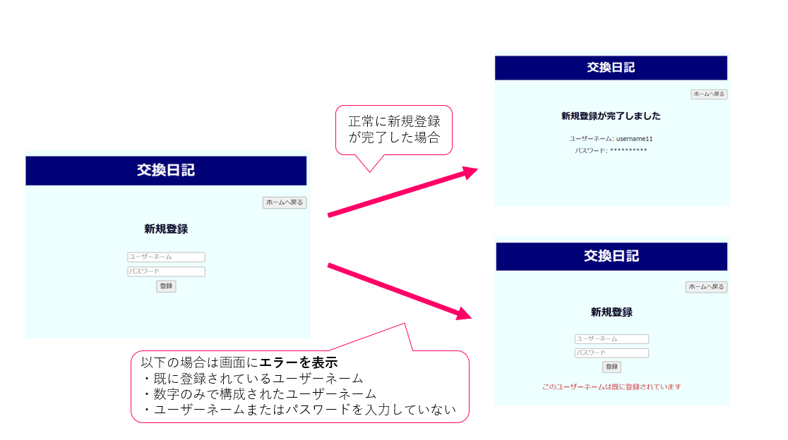
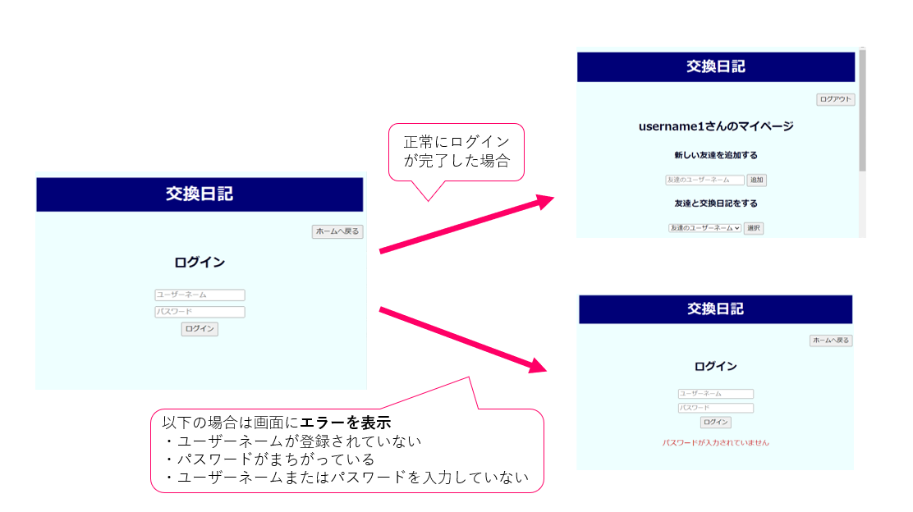
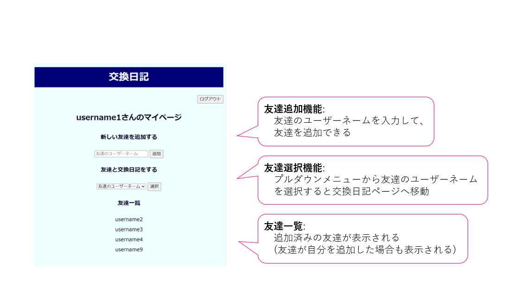
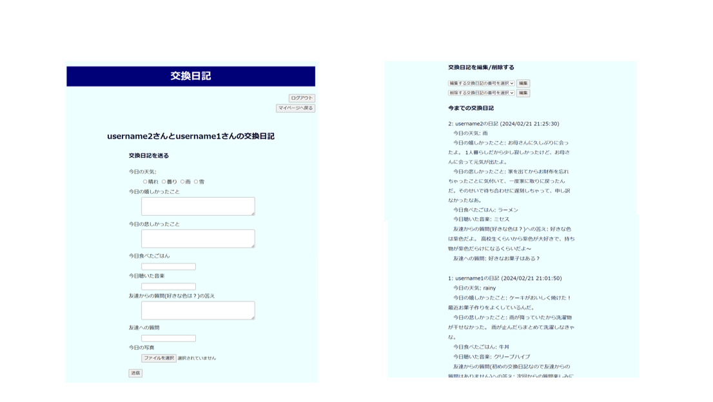

# オンライン交換日記
## 概要

友達と1対1で交換日記ができる。新規ユーザー登録・ログインをすることでマイページ及び交換日記送信画面にアクセスすることができる。

## 背景
現在のSNSでのコミュニケーションには、表面的な関係の助長、プライバシーの懸念、情報過多、自己演出などの問題が挙げられる。例えば、「いいね」などのシンプルなリアクションや短いコメントの送信が多いため深い感情や考えを共有する機会が少なかったり、SNSでの公開投稿では個人的な情報や感情をオープンに共有することができなかったり、情報が多すぎて重要な投稿やメッセージが埋もれてしまい個人間の大切なコミュニケーションが見過ごされることがあったり、自分のよい部分を見せようとして自己演出をしてしまい等身大の自分を周りに見せることができなかったりすることなどが挙げられる。これらの問題を解決するために、「自分のことを知ってほしい」、「相手のことを知りたい」という素朴な思いを大切にし、素直な気持ちで人間関係を深めるコミュニケーションとして、オンライン交換日記を提案する。

## 目的
オンライン交換日記では、ユーザー同士が互いの日常や思いを深く共有し合うことを目的とする。小学生時代に友達と行っていた懐かしの交換日記をオンライン空間に持ち込むことで、以前より手軽に、かつ現在のSNSより個人的で習慣化されたコミュニケーションを行うことができる。

## 使用技術
フロントエンド: HTML, CSS

バックエンド: PHP

データベース: MySQL

## 画面一覧（画面遷移及び各機能）
### ホーム画面（home.php）

ログインボタンを押すと、ログイン画面に遷移

新規登録ボタンを押すと、新規登録画面に遷移

### 新規登録画面（signup.php）・新規登録完了画面（signupcompleted）
オリジナルのユーザーネームとパスワードを入力して新規ユーザー登録が可能

以下の場合はエラーが表示される

・既に登録されているユーザーネームを入力した場合

・数字のみで構成されたユーザーネームを入力した場合

・ユーザーネームまたはパスワードを入力していない場合

新規ユーザー登録が完了すると、新規登録完了画面に遷移する

新規登録画面および新規登録完了画面からは、ホームに戻るボタンでホーム画面に戻ることができる

### ログイン画面（login.php）

登録済みのユーザーネームとパスワードを入力することでログインが可能

以下の場合はエラーが表示される

・登録されていないユーザーネームを入力した場合

・パスワードが間違っている場合

・ユーザーネームまたはパスワードを入力していない場合

　

ログインが完了すると、マイページに遷移

ログイン画面からは、ホームに戻るボタンでホーム画面に戻ることも可能

### マイページ（mypage.php）

追加済みの友達の一覧が表示される

友達のユーザーネームを入力することで友達の追加が可能

以下の場合はエラーが表示される

・登録されていないユーザーネームを入力した場合

・ユーザーネームを入力していない場合

　

追加済みの友達の中から友達を選択すると交換日記画面に遷移

ログアウトボタンを押すと、

### 交換日記画面（journal.php）

以下の内容を入力して交換日記を送信

・今日の天気

・今日の嬉しかったこと

・今日の悲しかったこと

・今日食べたごはん

・今日聴いた音楽

・友達からの質問の答え

・友達への質問

・今日の写真（今後機能追加予定）

　

今まで送り合った交換日記が画面にすべて表示される

それぞれの日記に番号が振られているので、その番号を選択することで、日記の編集および削除が可能

　

＜交換日記ならではの工夫した点＞

・お互いに質問を送り合って答えることができる

・相手から日記が送られてくるまで、自分から再度日記を送ることができない

## 今後の展望

・写真投稿機能

・複数人での交換日記送信

・友達追加の許可／拒否

・UIの改善
